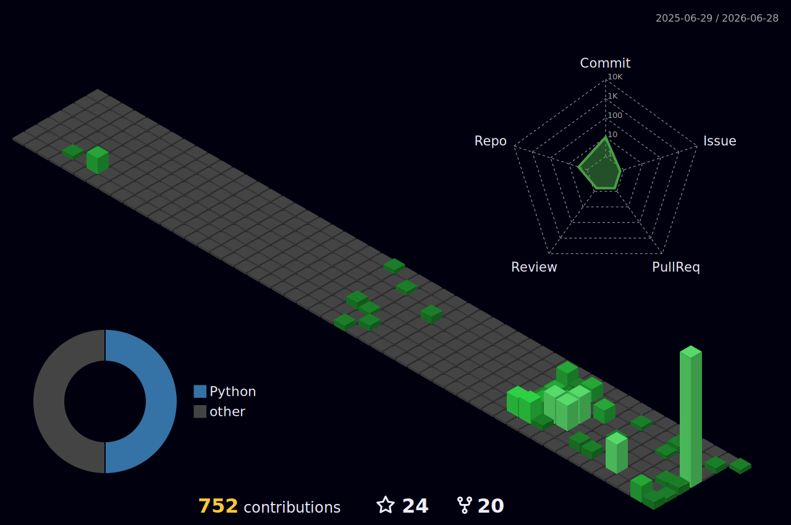

# Ilyas Belaoud

### > AI & Data Engineer.
**Engineering scalable intelligence.**

I focus on **Applied AI** - translating theoretical research into high-throughput production environments, prioritizing **Computational Efficiency** and **Data Reliability**.

---

### Technical Context

| **Domain** | **Stack** |
| :--- | :--- |
| **GenAI** |               |
| **AI & ML** |               |
| **Data Engineering** |            |
| **Compute & Backend APIs** |          |
| **DevOps & Infrastructure** |               |

---

### Activity

  

---

